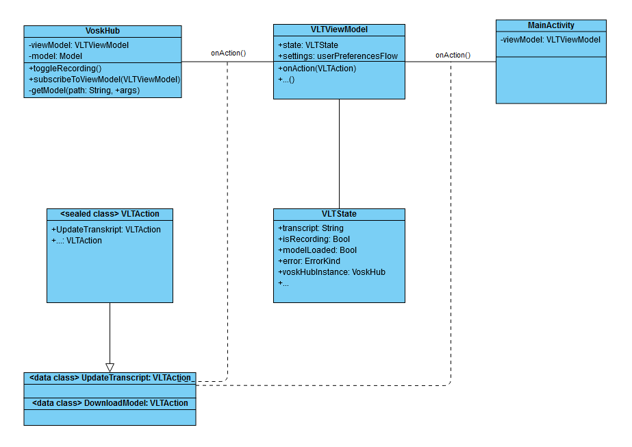

# Voskle Live Transcribe

Gruppenmitglieder:
- Tim Jonas Böttcher 3230384
- Leon Wollandt 3544361

Repository:
https://git.fh-aachen.de/lw6221s/voskle-live-transcribe.git

## Thema und Ziel

Um Kommunikation von taub(blinden) Menschen mit Personen zu ermöglichen, die keine geeignete Kommunikationsform beherrschen (z. B. taktile Gebärden, lormen…) 
ist eine Live-Transkriptionsapp gut geeignet. 
Diese nimmt kontinuierlich auf, was eine Person sagt und wandelt die gesprochenen Worte in Text um, welcher den Nutzern angezeigt wird.
Leider gibt es bis dato keine Apps, die für Braillezeilen optimiert sind. Die meisten Apps, welche derartige aufgaben erledigen, 
sind für gehörlose Menschen entwickelt und für taubblinde, insbesondere Nutzern von Braillezeilen, 
daher nur bedingt geeignet. Zudem sind sie oft auf auf eine stabile Internetverbindung angwiesen.

Diese Lücke wollen wir versuchen mit unserer App zu schließen. 
Hierzu verwenden wir Vosk, eine Open Source-Bibliothek, 
welche (verhältnismäig) präzise Offline-Transkription ermöglicht.
Insbesondere soll der output des transcribers für die systeminternen screenreader optimiert sein. Dieser erlaubt es Taubblinden Menschen, den transcript wahrzunehmen, indem er den Text auf angeschlossene Geräte, wie eine Barillezeile überträgt.

## Use Cases und Requirements

### Use Cases

- Ad Hoc-Kommunikation mit Tauben über Text, bzw mit Taubblinden über den Screenreader.
- Nutzung ohne verfügbare Internetverbindung und mit wenig Batterielast
- Kommunikation in Umgebungen, wo mehrere Personen an der Unterhaltung beteiligt sind.

### Requirements

- Gute Transkriptionsgenauigkeit trotz fehlender Internetanbindung,
- Ausreichend hohe Geschwindigkeit (Runtime Performance),
- Möglichst geringer Batterieverbauch, um eine Transkription über längere Zeit zu ermöglichen,
- Für systeminterne Screenreader optimierte UI
- Gute Farbkontraste bei der Schrift und Dark Mode-Option.
- Ausreichende Barrierefreiheit der UI

## Aufbau
- UI mit Jetpack Compose
- ViewModel schnittstelle zwischen data-layer und visual-layer
- Sprachdatenbank, welche aus Standardsprachen besteht, aber durch downloads erweitert werden kann.
- VOSK API-Manager Objekt zum erkennen der Sprache und synthetisierung von Text daraus und laden der Sprachdatenbank

## Arbeitspakete und Aufteilung
### Beide
- Generelle Funktionalität
- Einbindung der Vosk API
- Mikrofonanbindung

### Tim
- Barrierefreiheit

### Leon
- UI und Design

## Milestones

1. Die App fordert beim ersten Start Zugriff aufs Mikrofon an und zeigt einen Fehlertext an, wenn diese Berechtiungen nicht bestehen.
2. Die app lädt beim Start der App ein Vosk-Modell (entsprechend der Systemsprache oder einer voreingestellten standardsprache.)
3. Die App zeichnet per Knopfdruck Audio auf, sobald das Modell erfolgreich geladen wurden und unterbricht die Aufzeichnung, 
   durch Userinput.
4. Die aufgzeichnete Audiospur wird durch Vosk verarbeitet un der Text kontinuierlich auf dem Bildschirm angezeigt.
5. Weitere Verbesserungen, wie etwa Optionen zum Nachladen von weiteren Vosk-Modellen aus dem Internet oder dem 
   Dateisystem sowie Optionen zum Speichern des transkribierten Texts werden je nach Zeit implementiert.

## Ausblick
- Online nachladen von Vosk-Modellen
- speichern bzw. Teilen des transkribierten Texts